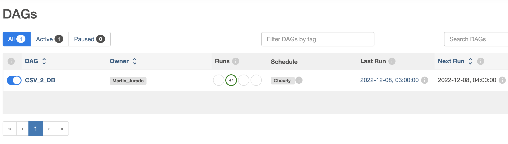

# Data Challenge 🚀🚀

This documentation regarding the Data Challenge Data migration POC that covers 2 challenges.

The challenge info is in the following link:

[file.pdf](./challenge_information/Ejercicio Data Arch.pdf)

## Check prerequisites 📋

Docker is used to run all the tasks in this challenge.

To run the environments it is necessary to have docker installed and a computer with a capacity greater than **8 GB** in memory.

For this we use three environments created to cover parts of the challenge in the folder **./environments**

The project structure has 8 folders, 4 for the challenges and 4 for supporting them.

# Challenge No. 1

### 1.1 Move historic data from files in CSV format to the new database.
For this challenge it is necessary to migrate csv files to a relational database, these files are located in the **./raw_data** folder.
To address the problem it was decided to use the following technologies:
- Python (Data processing).
- Airflow (Task automation)
- Postgres (Storage and structuring of information)

It is necessary to run the following lines to create the environments.

In the environment folder (**environments/airflow_enviroment/**):

Airflow creation

```console
user@machine data_challenge % cd environments/airflow_enviroment/

user@machine data_challenge % mkdir dags logs plugins

user@machine data_challenge % docker compose up airflow-init

user@machine data_challenge % docker-compose up

```

Postgrest creation

```console
user@machine data_challenge % docker run --name postgresql -e POSTGRES_USER=admin -e POSTGRES_PASSWORD=passw0rd -p 5433:5432 -v /Users/martinjurado/Documents/prj/data_challenge/environments/volume/data_db:/var/lib/postgresql/data -d postgres

```

To start with the requirements, the following structure was created in the database.

```sql
-- Data base creation
create database employee_data_db;
-- Schema creation
create schema hired_employees;
-- Tables Creation
--independent tables (Catalogs)
-- Departments
create table hired_employees.departments
(
	id serial
		constraint departments_pk
			primary key,
	departments text not null
);
-- Jobs
create table hired_employees.jobs
(
	id serial
        constraint jobs_pk
                primary key,
	job text not null
);

-- Table Hired employes
create table hired_employees.hired_employees
(
    id            serial
        constraint hired_employees_pk
            primary key,
    employee_name text,
    hired_date    text,
    department_id int
        constraint hired_employees_departments_id_fk
            references hired_employees.departments
            on delete cascade,
    job_id        int
        constraint hired_employees_jobs_id_fk
            references hired_employees.jobs
            on delete cascade
);


-- For the ingest is important to create a status table

-- Schema creation
create schema ingest_status;

-- Table  Creation

create table ingest_status.ingest_status
(
    id        serial
        constraint ingest_status_pk
            primary key,
    file_name text,
    file_size bigint,
    last_id   int
);
-- For the back-up is important to create a status table


-- Schema creation
create schema backup_status;

-- Table  Creation

create table backup_status.backup_status
(
    id        serial
        constraint ingest_status_pk
            primary key,
    table_name text,
    number_rows bigint,
    last_id   bigint
);


```
Data base schema employees


The primary function of the DAG is to automate the ingestion work, in which python is used to verify if the file sizes and ids change in order to update the database in postgrest. To correctly map the file ingest to the corresponding tables, each file is parsed with regular expressions.

Dag visualization



**The code informations is allocated the foldero ./01_csv_db**

### 1.2 Create a Rest API to receive new data.

The API structure is based on python using the postgres database from the first point of this challenge.

- The flask framework is used to create the REST API.

This time a Dockerfile is used to create the configurations of the container image.

environment location: **./environments/python_enviroment**

Flask Environment

```console

user@machine data_challenge % cd environments/python_enviroment

user@machine data_challenge % docker build -t flask_api .

user@machine data_challenge % docker run --name api_flask -p 8887:8887 -v /Users/martinjurado/Documents/prj/data_challenge/02_API:/home/prj -d flask_api


```

For the API, CRUD is used, where each of the end-points has the function of Create (Post), Read (GET), Update (PUT) and Delete (DELETE).

- http://localhost:8887/api/jobs
- http://localhost:8887/api/departments
- http://localhost:8887/api/employees


**The code informations is allocated the foldero ./02_API**

### 1.3 Create a feature to backup for each table and save it in the file system in AVRO format.


For this part of the task, python was used, which is in charge of connecting to the database, extracting the information from the table and saving each of the data in a structured way. In this case, only the back-up of the jobs table was performed.

### 1.4 Create a feature to restore a certain table with its backup.

For this task, the file generated in the backup is used, and the DAG in airflow to ingest the data in a massive way by the API created in task 1.2. 
"Since you have the same schema in the structure, only the file was loaded"

# Challenge No. 2

You need to explore the data that was inserted in the first challenge. The stakeholders ask for
some specific metrics they need. You should create an end-point for each requirement.

For this challenge, the API was used, but first the appropriate queries were designed to obtain the information, which are found in the following location: **./02_API**

2.1: **./02_API/query_2021_quarter.sql**

http://localhost:8887/api/2021/quarters


2.2: **./02_API/query_2021_deparments.sql**

http://localhost:8887/api/2021/departments


In the same way, to be able to visualize them, a small application was created in python to access it, it is necessary to run the following.

Flask Environment

```console

user@machine data_challenge % cd /environments/python_enviroment_dash

user@machine data_challenge % docker build -t dash_app .

user@machine data_challenge % docker run --name dash_app -p 8501:8501 -v /Users/martinjurado/Documents/prj/data_challenge/04_extra:/home/prj -d dash_app


```


